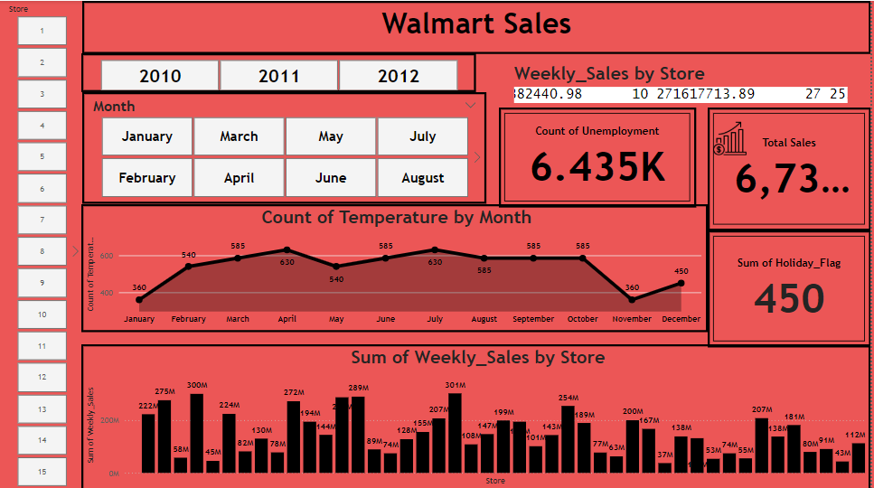

# 📊 Walmart Sales Dashboard - Power BI

This project is a Power BI dashboard that visualizes and analyzes Walmart sales data over the years **2010 to 2012**.

## 🔍 Overview

The dashboard offers valuable insights into:

- 📅 **Sales by Year & Month**  
- 🏬 **Weekly Sales per Store**
- 🌡️ **Temperature Trends by Month**
- 💼 **Unemployment Rates**
- 📈 **Total Sales Figures**
- 🏖️ **Holiday Impact on Sales**

It allows users to interact with slicers by **Store**, **Year**, and **Month** for customized exploration.

---

## 📷 Dashboard Preview

---

## 🛠️ How to Use

1. Download the `.pbix` file from this repo.
2. Open it using **Power BI Desktop**.
3. Interact with the filters to explore insights across different dimensions.

---

## 📁 Files Included

- `Walmart Sales Dashboard.pbix` — Main Power BI report
- `images/dashboard.png` — Dashboard screenshot
- `README.md` — Project documentation

---

## 💡 Insights Example

- **Highest weekly sales** occurred in 2011.
- **Store 20** had the top-performing weekly sales in multiple months.
- Sales **dropped in November**, possibly due to temperature drops.

---

## 📌 Tools Used

- Power BI Desktop  
- DAX for calculated measures  
- Slicers, Cards, Line & Bar Charts

---

## 📬 Contact

If you'd like to connect or discuss the project, feel free to reach out!

